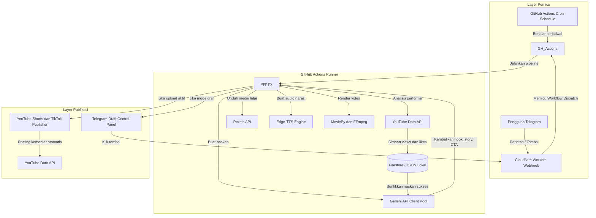

# Mesin Pembuatan dan Publikasi Konten Video Otomatis

Repositori ini berisi sebuah pipeline serverless yang sepenuhnya otonom dan siap produksi, dirancang untuk membuat, mengoptimasi, dan mempublikasikan konten video pendek ke platform media sosial (seperti YouTube Shorts dan TikTok) tanpa biaya infrastruktur.

Arsitektur sistem ini memanfaatkan compute serverless, penyimpanan NoSQL, dan otomasi browser untuk menjalankan siklus pembuatan dan publikasi konten secara berkelanjutan.

---

## Diagram Arsitektur Sistem

Sistem ini menggunakan arsitektur terdesentralisasi yang memanfaatkan GitHub Actions untuk tugas komputasi berat (rendering) dan Cloudflare Workers sebagai routing webhook yang ringan.

---

## Fitur Teknis Utama

### 1. Feedback Loop Berbasis Performa (Optimasi Level 5)
Sistem secara otomatis mengambil data statistik performa (views, likes) dari video yang sudah diunggah melalui YouTube Data API. Tiga naskah dengan views tertinggi kemudian disuntikkan kembali ke dalam instruksi prompt Gemini sebagai contoh kontekstual, memaksa model AI untuk belajar, beradaptasi, dan terus menghasilkan struktur naskah yang terbukti efektif.

### 2. Visual A/B Testing Otomatis
Subtitle engine mendukung beberapa tema tampilan visual (misalnya Classic Yellow, Neon Green, Cyberpunk Pink) yang dirotasi secara dinamis setiap kali video dikompilasi. Tema yang aktif disimpan bersama data performa di Firestore, memungkinkan analisis A/B testing visual jangka panjang untuk menentukan estetika mana yang paling menarik penonton.

### 3. Integrasi Google Trends (Trend Jacking)
Sebelum membuat naskah, sistem membaca RSS feed Google Trends untuk mengekstrak kata kunci pencarian yang sedang tren di wilayah target. Data tren ini disuntikkan ke dalam konteks AI sehingga model dapat secara alami menyelaraskan tema naskah psikologi dengan tren pencarian yang sedang berlangsung.

### 4. Kontrol Panel Draf via Telegram
Ketika publikasi otomatis dinonaktifkan, pipeline mengompilasi video dan mengirimkannya langsung ke chat Telegram pribadi dengan tombol inline ("Upload TikTok", "Upload YouTube"). Cloudflare Workers menerima event webhook saat tombol diklik dan memicu workflow dispatch ke GitHub Actions untuk menjalankan publikasi jarak jauh.

### 5. Ketangguhan Sistem Multi-Lapis
- **API Client Pool dan Rotasi Key:** Mencegah kegagalan pipeline akibat batas laju API (HTTP 429) dengan mempertahankan pool klien yang secara otomatis merotasi kunci API dan melacak key yang sedang dalam masa cooldown.
- **Retry Jaringan:** Mengimplementasikan loop retry dengan penundaan eksponensial untuk layanan eksternal (Pexels, Telegram).
- **Watchdog Tingkat OS:** Monitor latar belakang yang mengidentifikasi dan mematikan subproses FFmpeg yang hang selama fase rendering berat untuk mencegah runner terhenti.
- **Pembersih Otomatis:** Tugas pembersihan harian menghapus file sementara yang kedaluwarsa dan dokumen draf Firestore yang berumur lebih dari 7 hari agar tetap dalam batas kuota gratis.

---

## Tumpukan Teknologi

| Komponen | Teknologi |
|---|---|
| Bahasa | Python 3.11 |
| Komputasi | GitHub Actions, Cloudflare Workers |
| Database | Cloud Firestore (NoSQL) |
| Pemrosesan Media | MoviePy, FFmpeg, Librosa, Edge-TTS |
| Otomasi Browser | Playwright (Chromium) |
| Kecerdasan Buatan | Google GenAI SDK (Gemini 1.5/2.0) |

---

## Instalasi dan Konfigurasi

### Prasyarat
- Python 3.11 ke atas
- FFmpeg dan ImageMagick terinstal di mesin host

### Secrets dan Variabel Lingkungan
Konfigurasikan secrets berikut di repositori GitHub atau variabel lingkungan lokal Anda:

| Variabel | Deskripsi |
|---|---|
| `GEMINI_API_KEY` | API Key Gemini |
| `PEXELS_API_KEY` | API Key Pexels untuk klip latar |
| `TELEGRAM_BOT_TOKEN` | Token bot Telegram untuk webhook |
| `TELEGRAM_CHAT_ID` | Chat ID Telegram untuk notifikasi |
| `YOUTUBE_CREDENTIALS` | String JSON berisi kredensial OAuth2 client |
| `TIKTOK_COOKIES` | String JSON berisi sesi cookies TikTok |
| `FIREBASE_SERVICE_ACCOUNT` | Kredensial Service Account Firebase |
